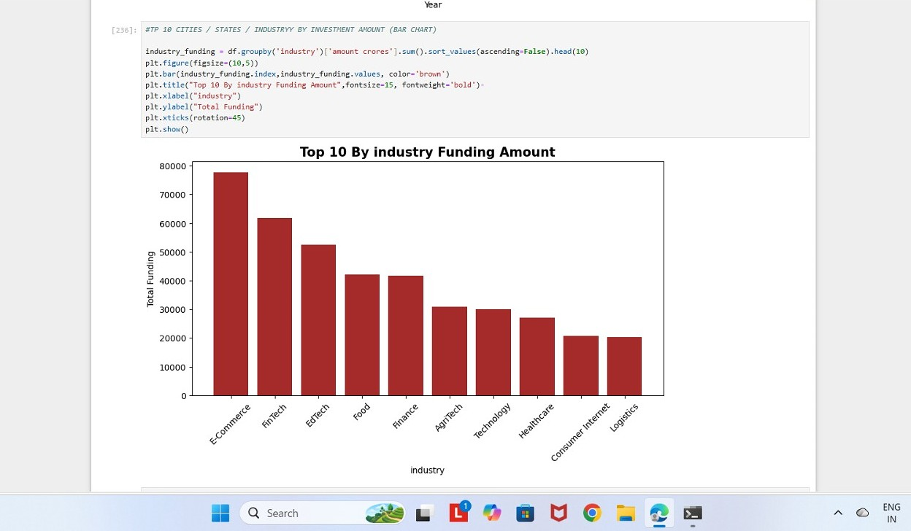

# indian-startup-funding-analysis
• This project analyzes startup funding data to understand investment trends,
  top sectors, and investor activity using Python-based data analysis and visualization.

• Objective
  Analyze startup funding patterns
  Identify top-funded sectors and investors
  Understand yearly investment trends

• Tools Used
  Python, Pandas, NumPy, Matplotlib, Seaborn, Jupyter Notebook

• Key Insights
  - Analyze startup funding trends
  - Identify top funded sectors/industries
  - Understand yearly investment
  - Visualise insights using Python and PowerBI

* Dataset Source - https://www.kaggle.com/datasets/madhans17/indian-startups-funding

 ## Screenshots
 ### 1) Dashboard
 

### 2) Funding Trend across years

### 3) Top Sectors

Author -
• Vivek Jadhav
