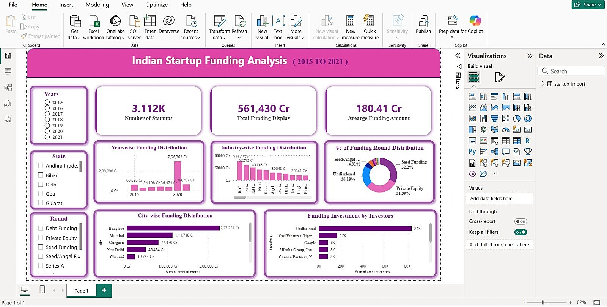
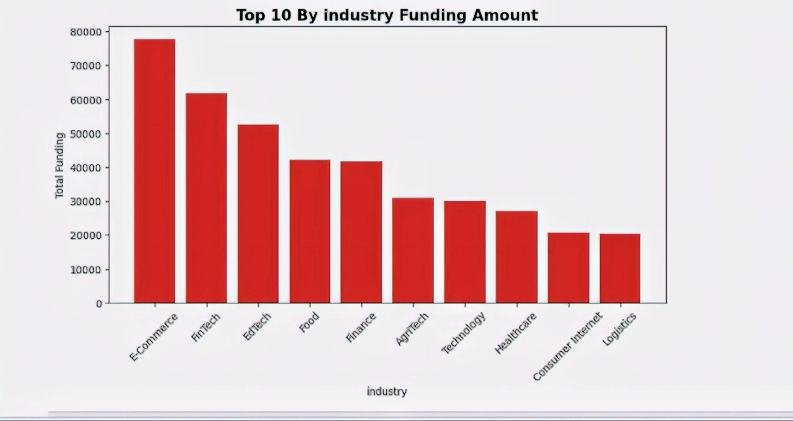
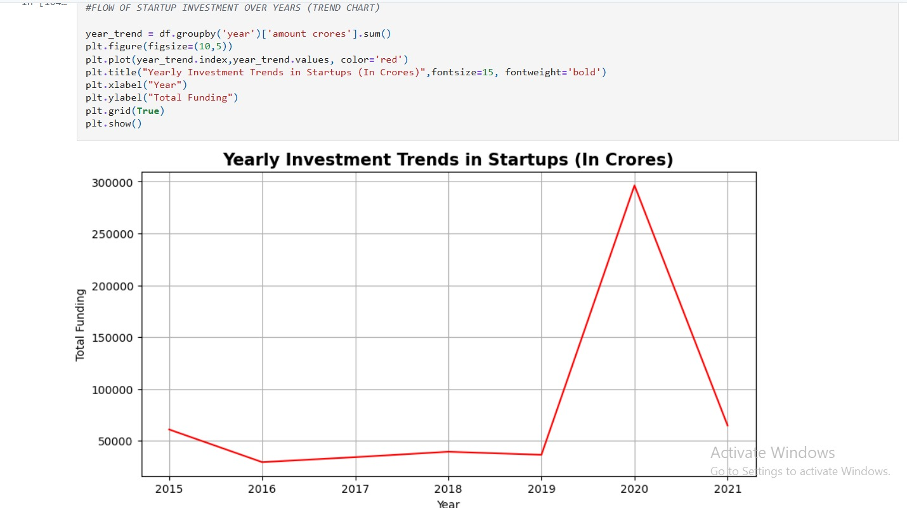

# 📊 Indian Startup Funding Analysis

## 📌 Project Overview

This project analyzes Indian startup funding data to uncover investment trends, top-funded sectors, leading investors, and funding patterns across India. The dataset was cleaned and analyzed using Python (Pandas, NumPy), and an interactive dashboard was developed in Power BI to present key business insights through visualizations.

## 🎯 Objectives

- Analyze startup funding trends.
- Identify top-funded sectors.
- Find leading investors.
- Study yearly funding patterns.
- Build an interactive Power BI dashboard.

## 📂 Dataset

- Source: Kaggle-Indian Startup Funding Dataset
- Records: 5,000+
- Columns: 10
- Format: Excel (.xlsx)

## 🛠️ Tools & Technologies

- Python
- Pandas
- NumPy
- Eda
- Dax
- Power BI
- Jupyter Notebook

## 🔄 Project Workflow

1. Data Collection
2. Data Cleaning
3. Exploratory Data Analysis (EDA)
4. Data Visualization
5. Power BI Dashboard
6. Business Insights

## 📈 Power BI Dashboard

An interactive Power BI dashboard was created to visualize startup funding trends and support data-driven insights.

### Dashboard Preview

#### 📌 Dashboard Overview

#### 📌 Top Industries by Funding

#### 📌 Year-wise Funding Trend

## 💡 Key Insights

- Identified the top-funded startup industries in India.
- Analyzed funding trends across different years.
- Found the cities attracting the highest startup investments.
- Identified the most active investors and funding rounds.
- Developed an interactive Power BI dashboard to visualize startup funding trends and support data-driven decision-making.

- ## 👨‍💻 Author

**Vivek Jadhav**

- 📧 Email: vivekjd00@gmail.com

-Updated README with professional project documentation.
